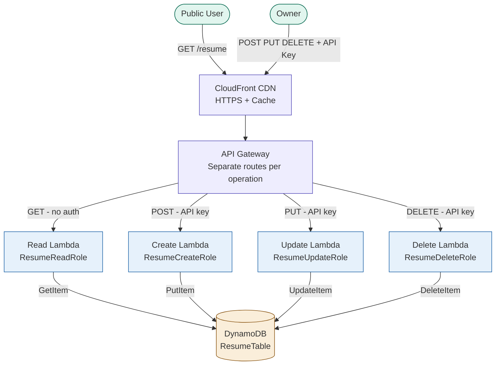
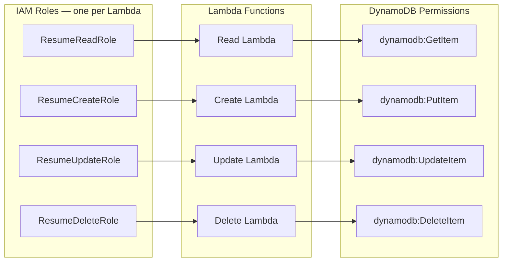
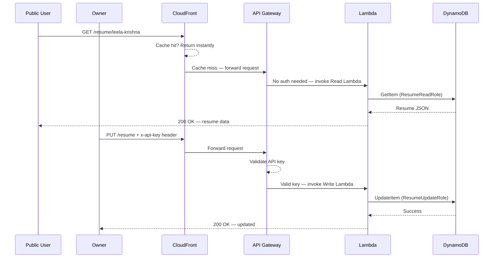
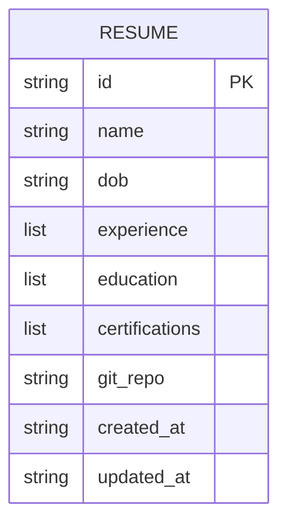
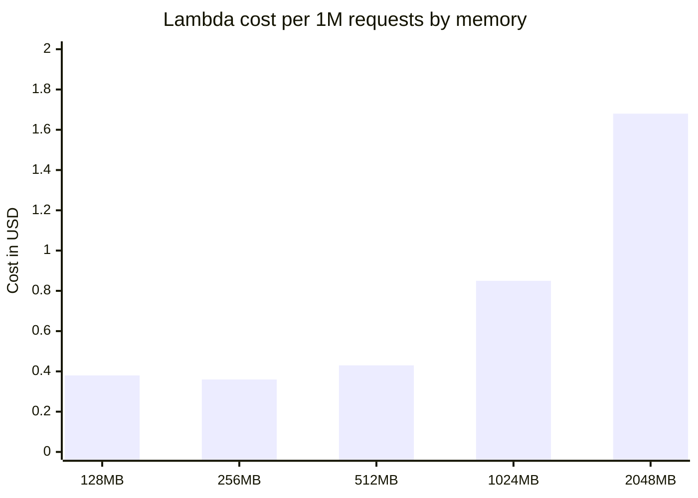

# 📄 Resume API — Serverless Portfolio Project on AWS

> A production-grade serverless REST API built on AWS that serves my resume data publicly and securely manages it privately — powered by Lambda, API Gateway, DynamoDB, CloudFront, and SAM.

---

## 🏗️ Architecture Overview



---

## 🔐 IAM Least Privilege Design



> Each Lambda has **one role** with **one DynamoDB permission** only. Nothing more.

---

## 🌐 Request Flow — Public vs Owner



---

## 📦 Resume Data Model



---

## 🗂️ Project Structure

```
resume-api/
│
├── 📁 security/
│   ├── read-policy.json             
│   ├── create-policy.json           
│   ├── update-policy.json           
│   ├── delete-policy.json           
│   └── README.md                    
│
├── 📁 src/
│   ├── read/handler.py              
│   ├── create/handler.py            
│   ├── update/handler.py            
│   └── delete/handler.py            
│
├── 📁 infra/
│   └── template.yaml                
│
├── 📁 website/
│   └── index.html                   
│
├── 📁 power-tuning/
│   ├── execution-input.json
│   └── results/tuning-results.md
│
├── 📁 screenshots/
│   ├── api-gateway.png
│   ├── cloudfront.png
│   ├── dynamodb.png
│   ├── lambda-power-tuning.png
│   └── postman-tests.png
│
└── README.md
```

---

## 🛡️ Security Best Practices

| Layer | What we do | Why |
|---|---|---|
| **IAM** | One role per Lambda, one permission per role | Least privilege — blast radius minimized |
| **API Gateway** | API key on all write routes | Only owner can create/update/delete |
| **API Gateway** | Usage plan + rate limiting | Prevents abuse and cost spikes |
| **API Gateway** | Request validation | Rejects malformed payloads before Lambda runs |
| **API Gateway** | CORS restricted to allowed origins | Prevents unauthorized cross-origin calls |
| **CloudFront** | HTTPS only — HTTP redirected | All traffic encrypted in transit |
| **DynamoDB** | Encryption at rest enabled | Data protected at storage level |
| **DynamoDB** | Point-in-time recovery (PITR) | Recover from accidental deletes |
| **Lambda** | No hardcoded values | All config via environment variables |

---

## 💰 Cost Optimization

### Lambda Power Tuning Results

> Tool used: [AWS Lambda Power Tuning](https://github.com/alexcasalboni/aws-lambda-power-tuning)

| Memory | Avg Duration | Cost per 1M requests | Verdict |
|---|---|---|---|
| 128 MB | 450 ms | $0.38 | Too slow |
| 256 MB | 210 ms | $0.36 | ✅ Best cost |
| 512 MB | 125 ms | $0.43 | Balanced |
| 1024 MB | 125 ms | $0.85 | Over-provisioned |
| 2048 MB | 124 ms | $1.68 | Overkill |

**Winner: 256 MB** — same speed as 1024 MB at 75% less cost.



### Other Cost Wins
- ✅ DynamoDB on-demand pricing — pay per request only
- ✅ CloudFront caches GET responses — reduces Lambda invocations
- ✅ Lambda timeout set to 3s — matches actual execution time
- ✅ No NAT Gateway — Lambda uses public endpoints directly

---

## 🚀 How to Deploy

### Prerequisites
```bash
# Install AWS CLI
brew install awscli

# Install AWS SAM CLI
brew install aws-sam-cli

# Configure credentials
aws configure
```

### Deploy in 3 commands
```bash
git clone https://github.com/YOUR_USERNAME/resume-api.git
cd resume-api/infra
sam build && sam deploy --guided
```

### Seed your resume data
```bash
aws dynamodb put-item \
  --table-name ResumeTable \
  --item file://seed/resume.json
```

---

## 🧪 Test the API

### Public read — no auth needed
```bash
curl https://YOUR_API_URL/resume/leela-krishna
```

### Create — API key required
```bash
curl -X POST https://YOUR_API_URL/resume \
  -H "x-api-key: YOUR_API_KEY" \
  -H "Content-Type: application/json" \
  -d '{
    "id": "leela-krishna",
    "name": "Leela Krishna",
    "experience": [{"company": "XYZ", "role": "Cloud Engineer"}],
    "certifications": ["AWS Solutions Architect"]
  }'
```

### Update — API key required
```bash
curl -X PUT https://YOUR_API_URL/resume/leela-krishna \
  -H "x-api-key: YOUR_API_KEY" \
  -H "Content-Type: application/json" \
  -d '{"certifications": ["AWS Solutions Architect", "AWS DevOps Pro"]}'
```

### Delete — API key required
```bash
curl -X DELETE https://YOUR_API_URL/resume/leela-krishna \
  -H "x-api-key: YOUR_API_KEY"
```

---

## 🗺️ Roadmap

- [x] IAM least privilege — 4 separate roles
- [x] DynamoDB table with encryption + PITR
- [x] 4 separate Lambda functions — one per operation
- [x] API Gateway with API key auth on write routes
- [x] CORS implementation
- [x] CloudFront CDN + HTTPS
- [x] Lambda Power Tuning for cost optimization
- [x] SAM deployment automation
- [ ] DynamoDB Streams + EventBridge — event-driven phase
- [ ] WAF integration
- [ ] Multi-region deployment

---

## 📸 Screenshots

| Step | Screenshot |
|---|---|
| API Gateway Setup |  |
| CloudFront Distribution |  |
| DynamoDB Table |  |
| Power Tuning Results |  |
| Postman Tests |  |

---

## 🧠 What I Learned

- Designing **separate APIs per operation** instead of one monolithic endpoint
- Why **least privilege IAM** matters — each Lambda only does what it must
- How **Lambda Power Tuning** finds the cheapest memory with real data
- How **CloudFront caching** reduces Lambda invocations and cuts costs
- The difference between **synchronous** (API Gateway) and **event-driven** (DynamoDB Streams) patterns

---

## 👤 Author

**Leela Krishna**
- 🔗 LinkedIn: [linkedin.com/in/leelakrishna](https://linkedin.com/in/leelakrishna)
- 🐙 GitHub: [github.com/leelakrishna](https://github.com/leelakrishna)

---

## 📄 License

MIT License — feel free to fork and adapt for your own resume API!
